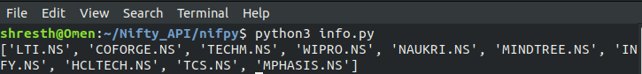

# nifpy

nifpy is an easy to use python package that can be used to fetch **live price**, **closing price**, **stock summary**, **index list** and fundamentals such as **income statement**, **cash flow statement** and **balance sheet** of stocks that trade on the National Stock Exchange(NSE).

## Getting Started

### Installation

You can install the package from Pypi
```bash
pip3 install nifpy
```

### Dependencies

You can install the dependencies by executing the following code in your terminal

```bash
pip3 install -r requirements.txt
```

### Methods

- [get_live_price](#get_live_price)
- [get_summary](#get_summary)
- [get_data](#get_data)
- [get_closing_price](#get_closing_price)
- [get_balance_sheet](#get_balance_sheet)
- [get_cash_flow](#get_cash_flow)
- [get_income_statement](#get_income_statement)

### get_live_price

This function returns the live/latest price for the symbol that has been passed as the parameter

``` python 
from nifpy import *
price = get_live_price(ticker)
print(price)

""" 
Parameters
-------------------------------
ticker : Contains the symbol/ticker for which the live price will be returned
"""
#Example
price = get_live_price('ITC.NS')
```

### get_summary

This function returns the summary of various attributes of the symbol/ticker that has been passed as the parameter

``` python 
from nifpy import *
summary = get_summary(symbol)
print(summary)

""" 
Parameters
-------------------------------
tickers : Contains the symbol/ticker for which the summary of various attributes will be returned

Returns
-------------------------------
A pandas dataframe that contains various attributes of a ticker such as the:

- Previous Close
- Open
- Bid
- Ask
- Day's Range
- 52 Week Range
- Volume
- Average Volume
- Market Cap
- Beta
- P/E Ratio
- EPS
- Earnings Date
- Forward Dividend and Yield
- Ex-Dividend Date
- 1 Year Target Estimate
"""
#Example
summary = get_summary('MARUTI.NS')
```

### get_data

This function returns the various attributes of a ticker such as the High, Low, Open, Close, Volume 
and Adjusted Close

``` python 
from nifpy import *
data = get_data(ticker, start=TODAY-PREV, end=TODAY)
print(data)

# TODAY = datetime.date.today()
# PREV = datetime.timedelta(90)
""" 
Parameters
-------------------------------
tickers : Contains the symbol/ticker for which various attributes mentioned above will be returned

start :   Contains the starting date
          Format: 'dd/mm/yyyy' as in '27/01/2020' 
          Default: Three months from today's date

end :     Contains the end date
          Format: 'dd/mm/yyyy' as in '27/04/2021'
          Default: Today's date
Returns
-------------------------------
A pandas dataframe that contains various attributes of a ticker such as the High, Low, Open, Close, Volume
and Adjusted Close
"""
#Example
data = get_data('WIPRO.NS','27/01/2020','27/04/2021')
```

### get_closing_price


This function returns the Closing price of a list of tickers mentioned in the parameter.

``` python 
from nifpy import *
closing = get_closing_price(tickers, start=TODAY-PREV, end = TODAY)
print(closing)

# TODAY = datetime.date.today()
# PREV = datetime.timedelta(90)

""" 
Parameters
-------------------------------
tickers : Contains a list of symbols for which the closing price will be returned

start : Contains the starting date from which closing price is required

Format: 'dd/mm/yyyy' as in '25/02/2021' 
Default: Three months from today's date

end : Contains the end date till which closing price is required
          
Format: 'dd/mm/yyyy' as in '27/02/2021' 
Default: Today's date

Other than a custom list some other parameters that can be passed directly to the function are:

- get_sensex()
- get_nifty_next50()
- get_nifty_bank()
- get_nifty_auto()
- get_nifty_financial()
- get_nifty_fmcg()
- get_nifty_it()
- get_nifty_media()
- get_nifty_metal()
- get_nifty_pharma()
- get_nifty_psubank()
- get_nifty_privatebank()
- get_nifty_realty()
- get_nifty()

Returns
-------------------------------
A pandas dataframe that contains the closing price of all symbols passed as the parameter to the function
"""
#Example
stonks = ['TCS.NS', 'TITAN.NS', 'TATASTEEL.NS','ICICIBANK.NS']

closing = get_closing_price(stonks,'27/01/2021','26/02/2021')

# Or you can directly pass indexes mentioned above
closing = get_closing_price(get_nifty_bank(),'27/01/2021','26/02/2021')

```

### get_balance_sheet

Used to obtain the balance sheet of the specified ticker

``` python 
from nifpy import *
balance_sheet = get_balance_sheet(symbol)
print(balance_sheet)

"""
Parameters
-------------------------------
symbol : It is used to specify the symbol/ticker for   which the balance sheet has to be fetched

Returns
--------------------------------
A dataframe that contains the balance sheet of the company
"""
#Example
balance_sheet = get_balance_sheet('RELIANCE.NS')
```

### get_cash_flow

Used to obtain the cash flow statement of the specified ticker

``` python 
from nifpy import *
cash_flow = get_cash_flow(symbol)
print(cash_flow)

""" 
Parameters
-------------------------------
symbol : It is used to specify the symbol/ticker for which the cash flow has to be fetched

Returns
--------------------------------
A dataframe that contains the cash flow statement of the company
"""
#Example
cash_flow = get_cash_flow('HCLTECH.NS')
```

### get_income_statement
Used to obtain the income statement of the specified ticker

``` python 
from nifpy import *
inc_statement = get_income_statement(symbol)
print(inc_statement)

""" 
Parameters
-------------------------------
symbol : It is used to specify the symbol/ticker for which the income statement has to be fetched

Returns
--------------------------------
A dataframe that contains the income statement of the company
"""
#Example
inc_statement = get_income_statement('TITAN.NS')
```

### Indices

- get_nifty()
- get_sensex()
- get_nifty_next50()
- get_nifty_bank()
- get_nifty_auto()
- get_nifty_financial()
- get_nifty_fmcg()
- get_nifty_it()
- get_nifty_media()
- get_nifty_metal()
- get_nifty_pharma()
- get_nifty_psubank()
- get_nifty_privatebank()
- get_nifty_realty()

``` python
from nifpy import *
it_stonks = get_nifty_it()
print(it_stonks)
```


 
In a similar way stocks trading in other indices are returned as a list and can be used for further analysis.